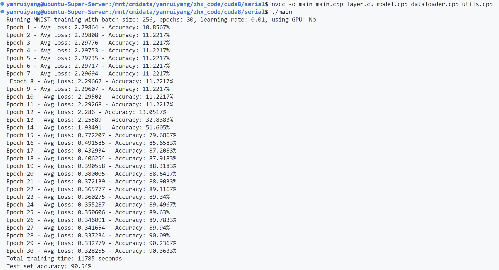
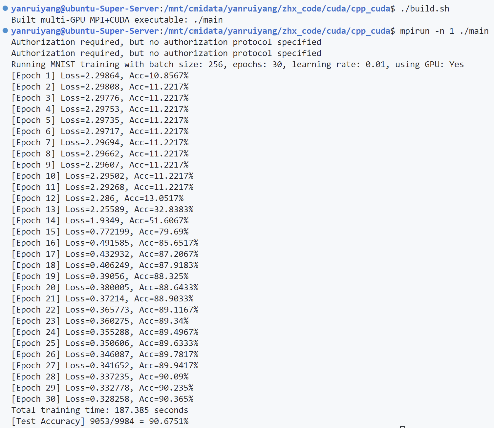
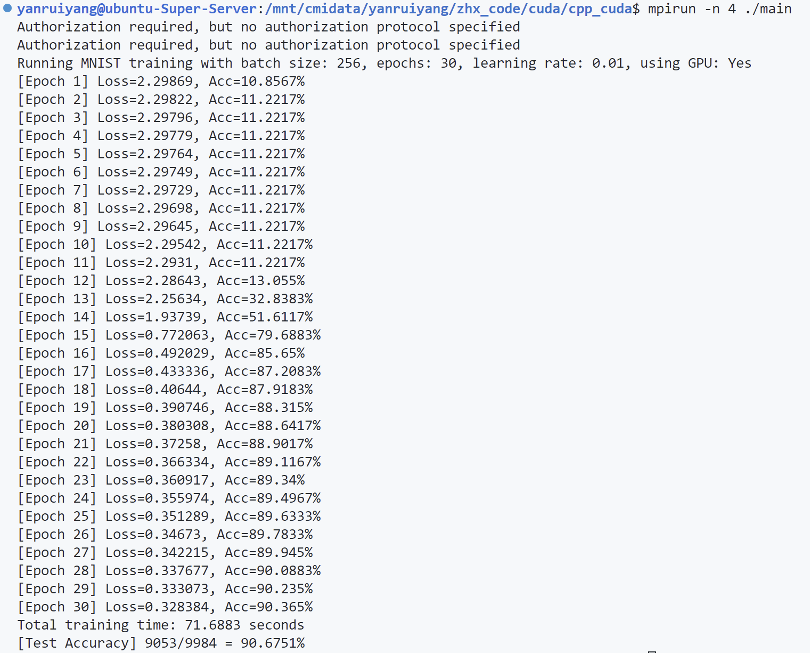
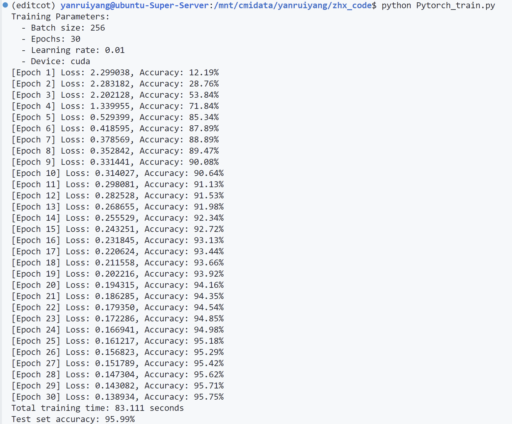
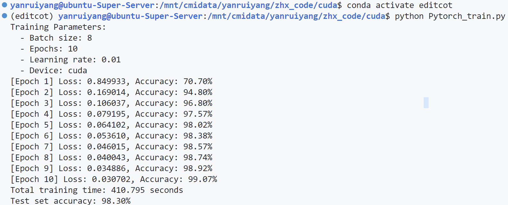
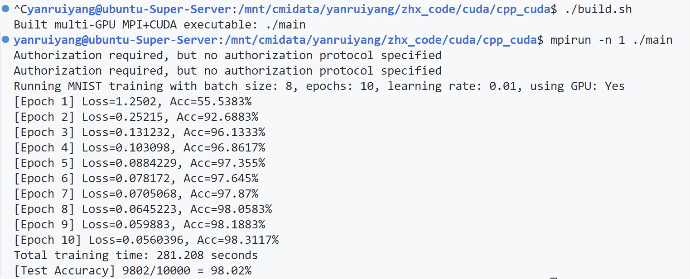

# 基于C/C++和cuda的并行神经网络框架


## 零、代码运行

```bash
./build.sh

mpirun -n num_processes ./main
```

## 一、效果展示

### CPU运行版本:

### 单GPU运行版本:

### 多GPU运行版本:

### PyTorch运行版本：


上述结果整理如下表所示:

| 训练参数          | 多GPU  | 单GPU  | CPU  | 
|-------------------|-------|-------|------|
| 批大小 (batch size) | 256   | 256   | 256  |
| 迭代次数 (epochs)  | 30    | 30    | 30   |
| 学习率 (learning rate) | 0.01  | 0.01  | 0.01 |
| 使用 GPU 数目        | 4   | 1   | 0   |

| 运行时间 (seconds) | 多GPU  | 单GPU  | CPU  |
|-------------------|-------|-------|------|
| 总训练时间        | 71.69 | 187.39| 11785 |
| Test Accuracy     | 90.675%| 90.53%| 90.54%|

| 加速比            | 多GPU  | 单GPU  |
|-------------------|-------|-------|
| 相对加速比 (相对于前一版本) | 2.61 | 62.89 |
| 绝对加速比 (相对于CPU串行) |  164.39   | 62.89 |


### 多GPU加速比分析

当batch_size比较小的时候（16、64、128），这时GPU的核心跑不满，因此多GPU无法达到理想的加速比。因此我们选择batch_size=256进行测试

由于我们小组使用的服务器MPI版本不能操纵GPU内部的指针，因此在多GPU进行模型参数和梯度的同步时，需要将模型的所有参数移动到CPU，然后执行MPI_AllReduce进行CPU指针上的同步，然后将同步后的内存移动到GPU。

上面的做法显然是降低了模型运行的效率，然而考虑到服务器并不属于个人的私人财产，权宜之下，我们小组采用了这种稍微牺牲性能，但保证服务器的软硬件环境不受影响的做法。

### 跟Pytorch的对比

从上面的图片我们不难看出，当batch_size比较大，我们小组实现的运行速度略慢于Pytorch，但是当我们把batch_size调成8，却又有不同的结果：

**Pytorch:**


**本实验模型:**

我们的代码在小batch上性能明显优于pytorch

### 收敛速度分析

从收敛速度的角度来说，我们实现的神经网络仍然弱于Pytorch，这可能是因为：

我们当前使用的是最基础的 SGD 优化器，没有引入 动量（Momentum）、Adam 或 学习率调度（LR Scheduler） 等技巧。相比之下，PyTorch 默认提供AdamW 等高级优化器，具有自适应学习率机制和warmup、cosine annealing 等学习率调度策略，有助于更快、更稳定地收敛。

但是，本次作业的工作重点在于运行速度，对于收敛速度我们不做关注。


## 二.实验过程
### 实验环境
- CPU型号:Intel(R) Xeon(R) Platinum 8352Y CPU @ 2.20GHz
- GPU型号:NVIDIA A100-SXM4-40GB
- 操作系统: Linux
- 内核版本: Linux ubuntu-Super-Server 6.8.0-59-generic
### 实验数据集
- MNIST手写数字分类数据集
### 迭代过程
**注:** 在该小节中主要介绍实验的迭代流程和遇到的困难及其解决方法,详细的代码原理的讲解见 **四.代码原理**,为方便表达,下面我们将cpu版本的命名为1.\*,单gpu版本的命名为2.\*,多gpu版本的命名为3.\*.
> **版本1.0** 基于cpp的串行cpu版本神经网络构建

我们编写`layer.h`,`model.h`,`dataloader.h`,`utils.h`以及他们对应的具体实现cpp文件还有`main.cpp`文件,首先介绍一下各个文件的主要内容:

- layer.h/layer.cpp :定义了神经网络中要用到的基础层:如卷积层(Conv2d),平均池化层(AvgPool2d),激活函数(ReLU),线性层(Linear)等.
- dataloader.h/dataloader.cpp :定义了数据读取器用于加载MNIST数据集,需要指出的是此时的数据加载器只支持batch_size为1,相当于训练都是batch取1的随机梯度法
- model.h/model.cpp :定义了模型的基础结构,具备可扩展性,可以支持自定义模型架构,本实验中选取的架构为简单的二维cnn网络,数据将顺序通过卷积层1,激活层1,池化层1,卷积层2,激活层2,池化层2,线性层1,线性层2后输出分类预测结果向量.
- utils.h/utils.cpp :定义了一些工具函数,如交叉熵损失计算函数,矩阵乘法函数,卷积计算函数等
- main.cpp :定义了训练参数,进行模型的定义,训练,以及在验证集上进行验证模型分类准确率,计算训练用时等.

至此我们已经实现了串行的CPU版本的神经网络的架构构建,完成了基础目标.
> **版本1.1** 将1.0做适当修改,使其兼容后续Cuda

**遇到的问题1:** 在将版本1.0的代码进一步修改为基于Cuda的单gpu并行时,我们考虑到原来使用的cpp语言的vector数组并不是非常兼容Cuda.

**解决办法:** 为推进Cuda版本的改进,我们将1.0版本中的所有vector数组都修改为一维数组float\*,int\*等,这样既方便后续的改进,也可以利用一维数组这一数据结构的空间连续性取得进一步的加速比.

> **版本1.2** 修正1.1版本的内存泄漏问题

**遇到的问题2:** 在1.1版本修正后,大量的数组都由vector变为了动态分配的指针,需要自己手动管理分配内存.虽然这样带来的部分的加速和便于后续改进,但是我们很快发现由于代码中存在部分内存分配后未及时释放,运行时存在内存泄漏,在训练到一定轮次时会造成大量内存消耗.

**解决办法:** 利用C/cpp的内存分析工具 `Valgrind` 来调试代码,定位出错的位置并加以分析,最后成功修复内存泄漏的错误.
> **版本2.0** 基于Cuda的单gpu并行版本神经网络构建

我们增加了一个训练参数 `"is_gpu"` 来指定训练时用 gpu 还是 cpu 进行训练.同时我们编写一个新的文件 `layer.cu` ,将 cpu 的串行训练版本的逻辑完整的保存下来,置于 is_gpu = 0 的情况,在对应将各层的逻辑改写,为conv层与linear层的前向计算和反向传播编写核函数,并且对应将梯度更新也加上gpu版本的,池化层和relu层由于没有梯度更新,只需要对应增加前向计算和反向传播,然后为各个layer都加上一个 *.cuda() 接口,用于将数据从host主机传到device设备上. 

同时我们对应修改了model.cpp,为其增加了一个cuda()接口,用于调用前面提到的层的所有层的cuda()接口.

经过这一版本后,我们的神经网络已经可以支持用gpu加速,通过参数来选择训练所用的设备是cpu还是gpu,但是仍然只支持 batch_size = 1 的随机梯度法.

> **版本2.1** 修复了版本2.0中学习不到特征,参数无法更新的错误

**遇到的问题3:** 在修改后的gpu版本中出现准确率一直上不去,而是在10%左右,而且保持不变.由于代码全部非常长,光layer.cu就有接近1000多行,给我们的debug造成了不小的困难.

**解决办法:** 通过在model.cpp中每层计算结束后添加打印调试输出,每一个层的前向计算和反向传播后输出梯度矩阵和参数矩阵的部分信息,观察发现前面的层正常,在第一次经过relu层后出现nan,经过检查后发现为relu层中的尺寸成员变量没有及时更新而是一直保持为初始化时的0,而后续申请数组的大小又依赖relu中的尺寸确定,导致后续所有训练瘫痪,定位到bug后修复了错误

> **版本2.2和版本2.3** 分别为cpu和gpu版本增加了支持动态调整batch_size的功能

我们在 `dataloader.cpp` 和 `main.cpp` 中增加了动态调整 batch_size 的逻辑,首先是在cpu部分的代码中修改为版本2.2,然后又将gpu部分的代码同步优化为支持调整 batch_size 的版本2.3.由于二者的修改思路类似,故此处放在一起介绍:\
我们调整数据数组的大小根据 batch_size 大小申请内存,并且在传入网络时将数据以串联的形式传入.例如一张 MNIST 数据的大小为28x28=784,如果batch_size为16,则会申请长度为784x16的一个数组,索引0-783为第一张数据所处的位置,索引784-1567为第二张数据的位置,以此类推.包括每个层的梯度数组也需要按照 batch_size 来申请更多的内存存放各个数据计算出来的梯度,但是参数矩阵仍然维持只有一份,无需增加申请.在求完梯度后,我们按照索引将得到的各个数据的梯度方向求平均,再用这个平均梯度对参数做一次更新.所以整个过程中的参数的更新次数也会对应减少为 $n = 总数据量 / batch\_size$ .

至此我们已经实现了用单GPU来并行化神经网络的训练过程,并且可以支持修改 batch_size 进行训练,相比cpu版本获得了进一步加速.
> **版本3.0** 基于MPI与Cuda的多GPU并行训练的神经网络构建

实验中我们多GPU并行的思路如下:将一个batch_size做均匀划分为子batch,分配给各个GPU,每个GPU只需要计算自己的子batch的数据得出来的梯度.假设用四个gpu来跑batch_size为64的训练,则相当于每个gpu在计算batch_size = 16的梯度,然后将他们计算得到的梯度利用MPI进行进程间通信传输,聚合梯度后进行一次参数的更新.

此为本次实验的最终版本,基于 MPI+Cuda 来进行多GPU的并行,与单GPU版本的神经网络对比,4卡并行可以获得接近3的加速比(详见 **五.性能提升**)


### 多GPU理论分析

我们以 `batch_size = 256, gpu_nums = 4` 为例进行理论分析。

现在每个 GPU 每个批次取 64 个数据，计算对应的前向传播、损失和反向传播，流程如下：

#### 1. 数据并行 (Data Parallelism)

将 `global_batch = 256` 的数据划分为 `local_batch = 64`，分别送入 4 张 GPU 并行处理：

* 每张 GPU 拿到不同的样本数据进行 **前向传播**
* 每张 GPU 独立计算出本地 loss 和对应的梯度 `∂L/∂θ_local`

这种方式被称为 **数据并行训练**（Data Parallel Training），是目前最常见的多 GPU 分布式训练策略之一。


#### 2. 梯度同步与参数一致性

由于每张卡都拥有独立的一份模型副本，如果每张卡各自使用自己的梯度进行参数更新，训练会发生发散，模型无法收敛。因此我们在每一轮反向传播之后执行如下操作：

* 使用 `MPI_Allreduce` 对所有 GPU 的梯度进行求和，然后 **平均**，得到全局梯度 `∂L/∂θ_global`
* 将平均后的全局梯度分别写回到每个 GPU 上，保持每张卡上的模型更新一致

这个过程称为 **同步梯度更新（Synchronous Gradient Averaging）**。
核心操作如下：

```cpp
MPI_Allreduce(local_grad, global_grad, N, MPI_FLOAT, MPI_SUM, MPI_COMM_WORLD);
global_grad /= world_size;
```

同步后的梯度再用于每张 GPU 上的参数更新（`model.step(lr)`），从而实现了：

> 所有 GPU 上的模型参数始终一致，且每次都利用了全局 batch 的信息进行更新。


#### 3. 初始参数同步

为了确保每张 GPU 上的模型在训练初期参数完全一致，训练开始前调用：

```cpp
model.sync_weights();
```

该函数使用 `MPI_Bcast` 将 rank 0 的模型参数广播到所有 GPU，确保所有进程在初始状态使用完全相同的模型副本。


#### 4. 同步点分析

在一个训练 step 中，多 GPU 训练涉及 **一次同步通信**：

| 同步操作   | 用途       | 通信接口            | 说明                             |
| ------ | -------- | --------------- | ------------------------------ |
| 梯度同步   | 求平均梯度    | `MPI_Allreduce` | 每层的 `dweights`, `dbiases` 统一同步 |
| 初始参数同步 | 同步初始模型参数 | `MPI_Bcast`     | 模型初始化执行一次                    |

这些同步操作构成训练中的 **同步点（barriers）**，确保训练结果的可重复性与一致性。


